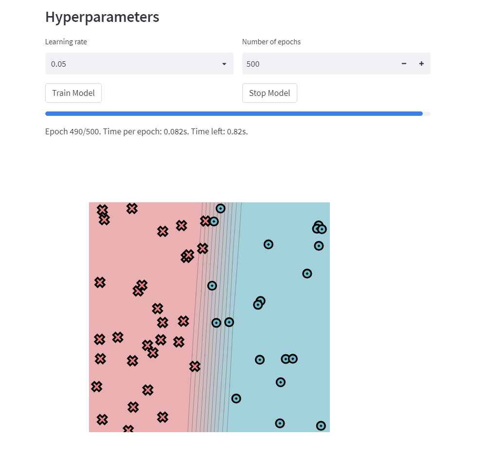

# MiniTorch Module 3


* Docs: https://minitorch.github.io/

* Overview: https://minitorch.github.io/module3.html


You will need to modify `tensor_functions.py` slightly in this assignment.

* Tests:

```
python run_tests.py
```

* Note:

Several of the tests for this assignment will only run if you are on a GPU machine and will not
run on github's test infrastructure. Please follow the instructions to setup up a colab machine
to run these tests.

This assignment requires the following files from the previous assignments. You can get these by running

```bash
python sync_previous_module.py previous-module-dir current-module-dir
```

The files that will be synced are:

        minitorch/tensor_data.py minitorch/tensor_functions.py minitorch/tensor_ops.py minitorch/operators.py minitorch/scalar.py minitorch/scalar_functions.py minitorch/module.py minitorch/autodiff.py minitorch/module.py project/run_manual.py project/run_scalar.py project/run_tensor.py minitorch/operators.py minitorch/module.py minitorch/autodiff.py minitorch/tensor.py minitorch/datasets.py minitorch/testing.py minitorch/optim.py

diagnostic output:
MAP

================================================================================
 Parallel Accelerator Optimizing:  Function tensor_map.<locals>._map,
D:\code\mle\mod3-RunxinShao\minitorch\fast_ops.py (141)
================================================================================


Parallel loop listing for  Function tensor_map.<locals>._map, D:\code\mle\mod3-RunxinShao\minitorch\fast_ops.py (141)
-------------------------------------------------------------------------|loop #ID
    def _map(                                                            |
        out: Storage,                                                    |
        out_shape: Shape,                                                |
        out_strides: Strides,                                            |
        in_storage: Storage,                                             |
        in_shape: Shape,                                                 |
        in_strides: Strides,                                             |
    ) -> None:                                                           |
                                                                         |
        dims_match = len(out_shape) == len(in_shape)                     |
        shapes_match = True                                              |
        if dims_match:                                                   |
            for i in range(len(out_shape)):                              |
                if out_shape[i] != in_shape[i]:                          |
                    shapes_match = False                                 |
                    break                                                |
                                                                         |
                                                                         |
        strides_match = True                                             |
        if dims_match:                                                   |
            for i in range(len(out_strides)):                            |
                if out_strides[i] != in_strides[i]:                      |
                    strides_match = False                                |
                    break                                                |
                                                                         |
        if dims_match and shapes_match and strides_match:                |
                                                                         |
            for i in prange(len(out)):-----------------------------------| #2
                out[i] = fn(in_storage[i])                               |
        else:                                                            |
                                                                         |
            for i in prange(len(out)):-----------------------------------| #3
                out_idx = np.zeros(MAX_DIMS, dtype=np.int32)-------------| #0
                in_idx = np.zeros(MAX_DIMS, dtype=np.int32)--------------| #1
                to_index(i, out_shape, out_idx)                          |
                broadcast_index(out_idx, out_shape, in_shape, in_idx)    |
                out_pos = index_to_position(out_idx, out_strides)        |
                in_pos = index_to_position(in_idx, in_strides)           |
                out[out_pos] = fn(in_storage[in_pos])                    |
--------------------------------- Fusing loops ---------------------------------
Attempting fusion of parallel loops (combines loops with similar properties)...

Fused loop summary:
+--0 has the following loops fused into it:
   +--1 (fused)
Following the attempted fusion of parallel for-loops there are 3 parallel for-
loop(s) (originating from loops labelled: #2, #3, #0).
--------------------------------------------------------------------------------
---------------------------- Optimising loop nests -----------------------------
Attempting loop nest rewrites (optimising for the largest parallel loops)...

+--3 is a parallel loop
   +--0 --> rewritten as a serial loop
--------------------------------------------------------------------------------
----------------------------- Before Optimisation ------------------------------
Parallel region 0:
+--3 (parallel)
   +--0 (parallel)
   +--1 (parallel)


--------------------------------------------------------------------------------
------------------------------ After Optimisation ------------------------------
Parallel region 0:
+--3 (parallel)
   +--0 (serial, fused with loop(s): 1)


Parallel region 0 (loop #3) had 1 loop(s) fused and 1 loop(s) serialized as part
 of the larger parallel loop (#3).
--------------------------------------------------------------------------------
--------------------------------------------------------------------------------

---------------------------Loop invariant code motion---------------------------
Allocation hoisting:
The memory allocation derived from the instruction at
D:\code\mle\mod3-RunxinShao\minitorch\fast_ops.py (173) is hoisted out of the
parallel loop labelled #3 (it will be performed before the loop is executed and
reused inside the loop):
   Allocation:: out_idx = np.zeros(MAX_DIMS, dtype=np.int32)
    - numpy.empty() is used for the allocation.
The memory allocation derived from the instruction at
D:\code\mle\mod3-RunxinShao\minitorch\fast_ops.py (174) is hoisted out of the
parallel loop labelled #3 (it will be performed before the loop is executed and
reused inside the loop):
   Allocation:: in_idx = np.zeros(MAX_DIMS, dtype=np.int32)
    - numpy.empty() is used for the allocation.
None
ZIP

================================================================================
 Parallel Accelerator Optimizing:  Function tensor_zip.<locals>._zip,
D:\code\mle\mod3-RunxinShao\minitorch\fast_ops.py (184)
================================================================================


Parallel loop listing for  Function tensor_zip.<locals>._zip, D:\code\mle\mod3-RunxinShao\minitorch\fast_ops.py (184)
----------------------------------------------------------------------------|loop #ID
    def _zip(                                                               |
        out: Storage,                                                       |
        out_shape: Shape,                                                   |
        out_strides: Strides,                                               |
        a_storage: Storage,                                                 |
        a_shape: Shape,                                                     |
        a_strides: Strides,                                                 |
        b_storage: Storage,                                                 |
        b_shape: Shape,                                                     |
        b_strides: Strides,                                                 |
    ) -> None:                                                              |
                                                                            |
        dims_match = (len(out_shape) == len(a_shape) == len(b_shape))       |
        shapes_match = True                                                 |
        if dims_match:                                                      |
            for i in range(len(out_shape)):                                 |
                if not (out_shape[i] == a_shape[i] == b_shape[i]):          |
                    shapes_match = False                                    |
                    break                                                   |
                                                                            |
                                                                            |
        strides_match = True                                                |
        if dims_match:                                                      |
            for i in range(len(out_strides)):                               |
                if not (out_strides[i] == a_strides[i] == b_strides[i]):    |
                    strides_match = False                                   |
                    break                                                   |
                                                                            |
        if dims_match and shapes_match and strides_match:                   |
                                                                            |
            for i in prange(len(out)):--------------------------------------| #7
                out[i] = fn(a_storage[i], b_storage[i])                     |
        else:                                                               |
                                                                            |
            for i in prange(len(out)):--------------------------------------| #8
                out_idx = np.zeros(MAX_DIMS, dtype=np.int32)----------------| #4
                a_idx = np.zeros(MAX_DIMS, dtype=np.int32)------------------| #5
                b_idx = np.zeros(MAX_DIMS, dtype=np.int32)------------------| #6
                                                                            |
                to_index(i, out_shape, out_idx)                             |
                broadcast_index(out_idx, out_shape, a_shape, a_idx)         |
                broadcast_index(out_idx, out_shape, b_shape, b_idx)         |
                                                                            |
                out_pos = index_to_position(out_idx, out_strides)           |
                a_pos = index_to_position(a_idx, a_strides)                 |
                b_pos = index_to_position(b_idx, b_strides)                 |
                                                                            |
                out[out_pos] = fn(a_storage[a_pos], b_storage[b_pos])       |
--------------------------------- Fusing loops ---------------------------------
Attempting fusion of parallel loops (combines loops with similar properties)...

Fused loop summary:
+--4 has the following loops fused into it:
   +--5 (fused)
   +--6 (fused)
Following the attempted fusion of parallel for-loops there are 3 parallel for-
loop(s) (originating from loops labelled: #7, #8, #4).
--------------------------------------------------------------------------------
---------------------------- Optimising loop nests -----------------------------
Attempting loop nest rewrites (optimising for the largest parallel loops)...

+--8 is a parallel loop
   +--4 --> rewritten as a serial loop
--------------------------------------------------------------------------------
----------------------------- Before Optimisation ------------------------------
Parallel region 0:
+--8 (parallel)
   +--4 (parallel)
   +--5 (parallel)
   +--6 (parallel)


--------------------------------------------------------------------------------
------------------------------ After Optimisation ------------------------------
Parallel region 0:
+--8 (parallel)
   +--4 (serial, fused with loop(s): 5, 6)


Parallel region 0 (loop #8) had 2 loop(s) fused and 1 loop(s) serialized as part
 of the larger parallel loop (#8).
--------------------------------------------------------------------------------
--------------------------------------------------------------------------------

---------------------------Loop invariant code motion---------------------------
Allocation hoisting:
The memory allocation derived from the instruction at
D:\code\mle\mod3-RunxinShao\minitorch\fast_ops.py (219) is hoisted out of the
parallel loop labelled #8 (it will be performed before the loop is executed and
reused inside the loop):
   Allocation:: out_idx = np.zeros(MAX_DIMS, dtype=np.int32)
    - numpy.empty() is used for the allocation.
The memory allocation derived from the instruction at
D:\code\mle\mod3-RunxinShao\minitorch\fast_ops.py (220) is hoisted out of the
parallel loop labelled #8 (it will be performed before the loop is executed and
reused inside the loop):
   Allocation:: a_idx = np.zeros(MAX_DIMS, dtype=np.int32)
    - numpy.empty() is used for the allocation.
The memory allocation derived from the instruction at
D:\code\mle\mod3-RunxinShao\minitorch\fast_ops.py (221) is hoisted out of the
parallel loop labelled #8 (it will be performed before the loop is executed and
reused inside the loop):
   Allocation:: b_idx = np.zeros(MAX_DIMS, dtype=np.int32)
    - numpy.empty() is used for the allocation.
None
REDUCE

================================================================================
 Parallel Accelerator Optimizing:  Function tensor_reduce.<locals>._reduce,
D:\code\mle\mod3-RunxinShao\minitorch\fast_ops.py (236)
================================================================================


Parallel loop listing for  Function tensor_reduce.<locals>._reduce, D:\code\mle\mod3-RunxinShao\minitorch\fast_ops.py (236)
-----------------------------------------------------------------|loop #ID
    def _reduce(                                                 |
        out: Storage,                                            |
        out_shape: Shape,                                        |
        out_strides: Strides,                                    |
        a_storage: Storage,                                      |
        a_shape: Shape,                                          |
        a_strides: Strides,                                      |
        reduce_dim: int,                                         |
    ) -> None:                                                   |
                                                                 |
        for i in prange(len(out)):-------------------------------| #10
            out_idx = np.zeros(MAX_DIMS, dtype=np.int32)---------| #9
            to_index(i, out_shape, out_idx)                      |
            out_pos = index_to_position(out_idx, out_strides)    |
                                                                 |
            dim_size = a_shape[reduce_dim]                       |
            dim_stride = a_strides[reduce_dim]                   |
                                                                 |
            result = out[out_pos]                                |
                                                                 |
            base_pos = index_to_position(out_idx, a_strides)     |
                                                                 |
            curr_pos = base_pos                                  |
            for j in range(dim_size):                            |
                result = fn(result, a_storage[curr_pos])         |
                curr_pos += dim_stride                           |
                                                                 |
            out[out_pos] = result                                |
--------------------------------- Fusing loops ---------------------------------
Attempting fusion of parallel loops (combines loops with similar properties)...
Following the attempted fusion of parallel for-loops there are 2 parallel for-
loop(s) (originating from loops labelled: #10, #9).
--------------------------------------------------------------------------------
---------------------------- Optimising loop nests -----------------------------
Attempting loop nest rewrites (optimising for the largest parallel loops)...

+--10 is a parallel loop
   +--9 --> rewritten as a serial loop
--------------------------------------------------------------------------------
----------------------------- Before Optimisation ------------------------------
Parallel region 0:
+--10 (parallel)
   +--9 (parallel)


--------------------------------------------------------------------------------
------------------------------ After Optimisation ------------------------------
Parallel region 0:
+--10 (parallel)
   +--9 (serial)


Parallel region 0 (loop #10) had 0 loop(s) fused and 1 loop(s) serialized as
part of the larger parallel loop (#10).
--------------------------------------------------------------------------------
--------------------------------------------------------------------------------

---------------------------Loop invariant code motion---------------------------
Allocation hoisting:
The memory allocation derived from the instruction at
D:\code\mle\mod3-RunxinShao\minitorch\fast_ops.py (247) is hoisted out of the
parallel loop labelled #10 (it will be performed before the loop is executed and
 reused inside the loop):
   Allocation:: out_idx = np.zeros(MAX_DIMS, dtype=np.int32)
    - numpy.empty() is used for the allocation.
None
MATRIX MULTIPLY

================================================================================
 Parallel Accelerator Optimizing:  Function _tensor_matrix_multiply,
D:\code\mle\mod3-RunxinShao\minitorch\fast_ops.py (272)
================================================================================


Parallel loop listing for  Function _tensor_matrix_multiply, D:\code\mle\mod3-RunxinShao\minitorch\fast_ops.py (272)
-----------------------------------------------------------------------------------|loop #ID
@njit(parallel=True)                                                               |
def _tensor_matrix_multiply(                                                       |
    out_storage: Storage,                                                          |
    out_shape: Shape,                                                              |
    out_strides: Strides,                                                          |
    a_storage: Storage,                                                            |
    a_shape: Shape,                                                                |
    a_strides: Strides,                                                            |
    b_storage: Storage,                                                            |
    b_shape: Shape,                                                                |
    b_strides: Strides,                                                            |
) -> None:                                                                         |
                                                                                   |
    batch_size = out_shape[0] if len(out_shape) > 2 else 1                         |
    M = out_shape[-2]                                                              |
    N = out_shape[-1]                                                              |
    K = a_shape[-1]                                                                |
                                                                                   |
    a_batch_stride = a_strides[0] if len(a_shape) > 2 and a_shape[0] > 1 else 0    |
    b_batch_stride = b_strides[0] if len(b_shape) > 2 and b_shape[0] > 1 else 0    |
    out_batch_stride = out_strides[0] if len(out_shape) > 2 else 0                 |
                                                                                   |
                                                                                   |
    for batch in prange(batch_size):-----------------------------------------------| #11
                                                                                   |
        for i in range(M):                                                         |
            for j in range(N):                                                     |
                                                                                   |
                result = 0.0                                                       |
                                                                                   |
                for k in range(K):                                                 |
                                                                                   |
                    a_idx = (                                                      |
                        batch * a_batch_stride +                                   |
                        i * a_strides[-2] +                                        |
                        k * a_strides[-1]                                          |
                    )                                                              |
                    b_idx = (                                                      |
                        batch * b_batch_stride +                                   |
                        k * b_strides[-2] +                                        |
                        j * b_strides[-1]                                          |
                    )                                                              |
                                                                                   |
                    result += a_storage[a_idx] * b_storage[b_idx]                  |
                                                                                   |
                out_idx = (                                                        |
                    batch * out_batch_stride +                                     |
                    i * out_strides[-2] +                                          |
                    j * out_strides[-1]                                            |
                )                                                                  |
                                                                                   |
                out_storage[out_idx] = result                                      |
--------------------------------- Fusing loops ---------------------------------
Attempting fusion of parallel loops (combines loops with similar properties)...
Following the attempted fusion of parallel for-loops there are 1 parallel for-
loop(s) (originating from loops labelled: #11).
--------------------------------------------------------------------------------
----------------------------- Before Optimisation ------------------------------
--------------------------------------------------------------------------------
------------------------------ After Optimisation ------------------------------
Parallel structure is already optimal.
--------------------------------------------------------------------------------
--------------------------------------------------------------------------------

---------------------------Loop invariant code motion---------------------------
Allocation hoisting:
No allocation hoisting found
None


3.4 CPUGPU difference


Train using CPU
Simple dataset
time and parameters

loss,epoch,correct


Diag dataset
time and parameters

loss and epoch,correct


split dataset
time and parameters


xor dataset
time and parameters


